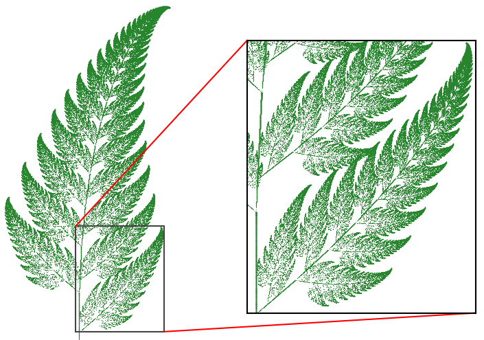
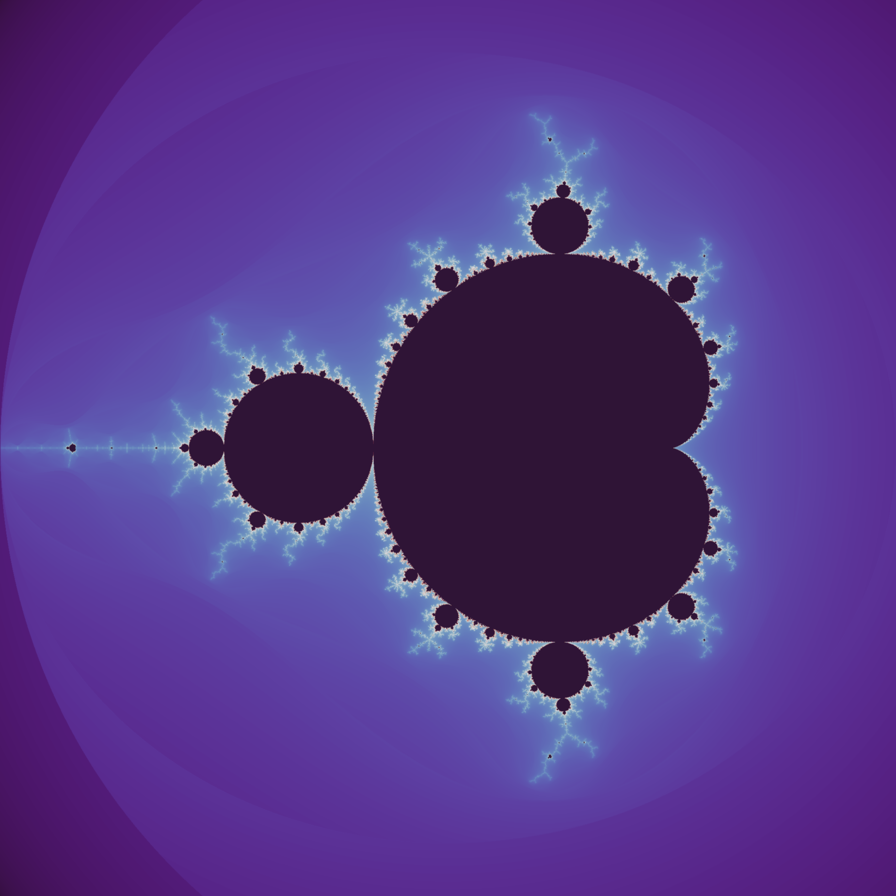
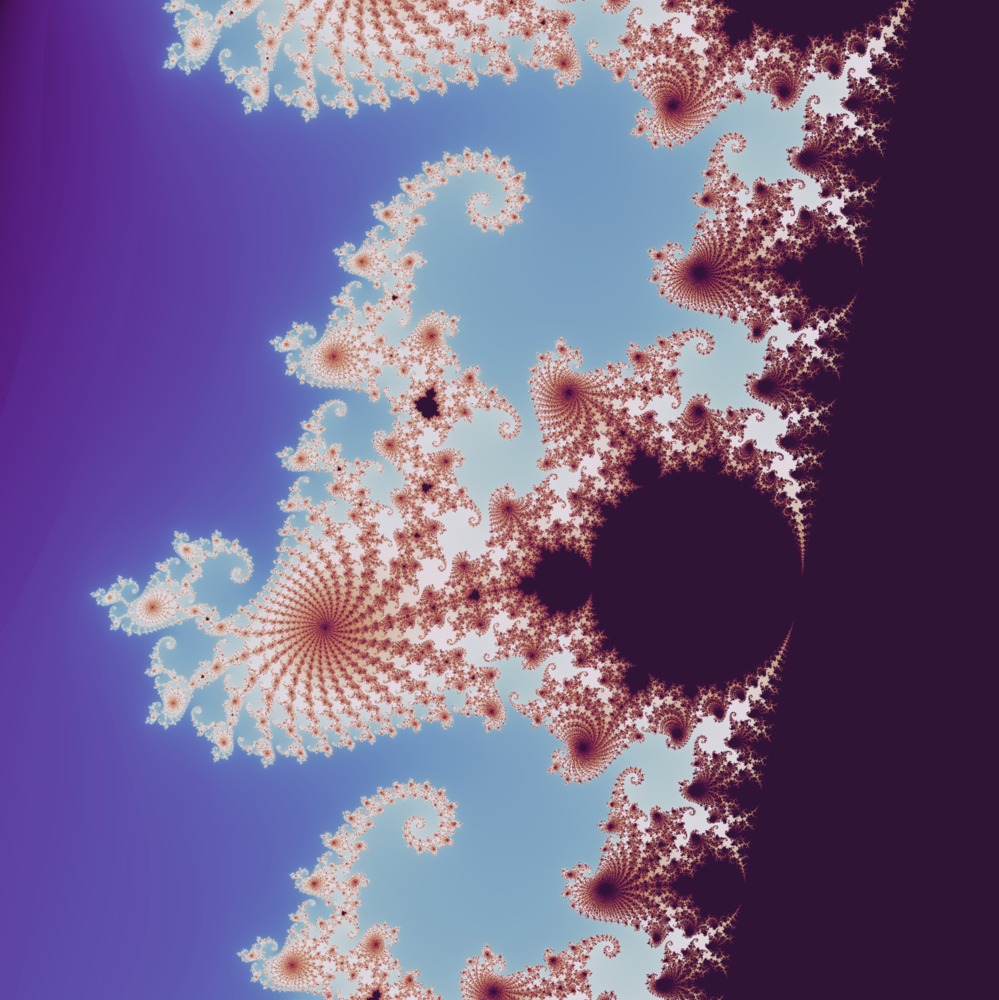
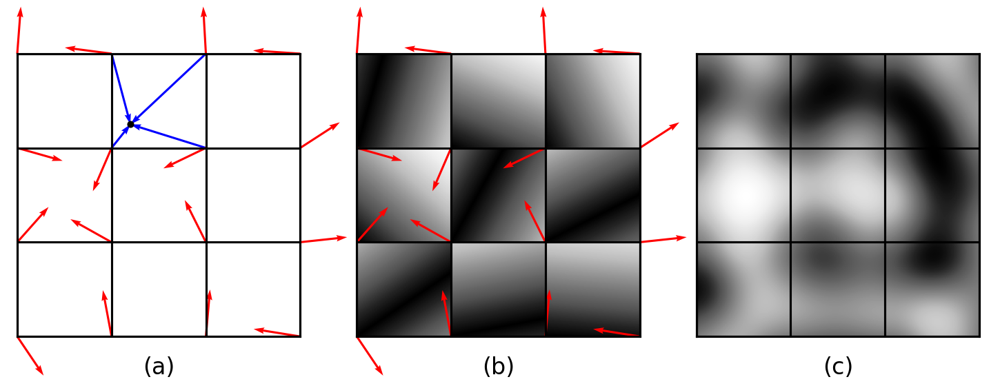
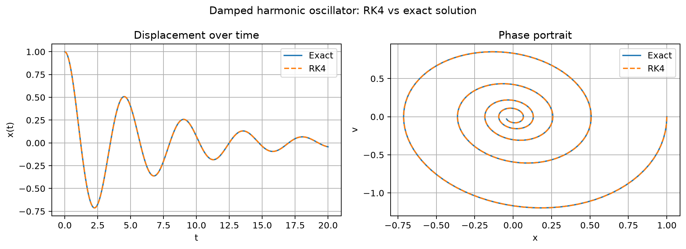
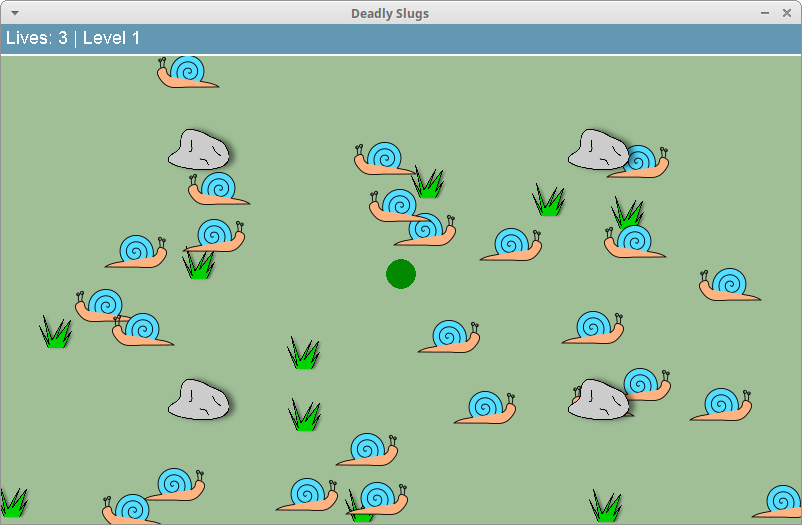
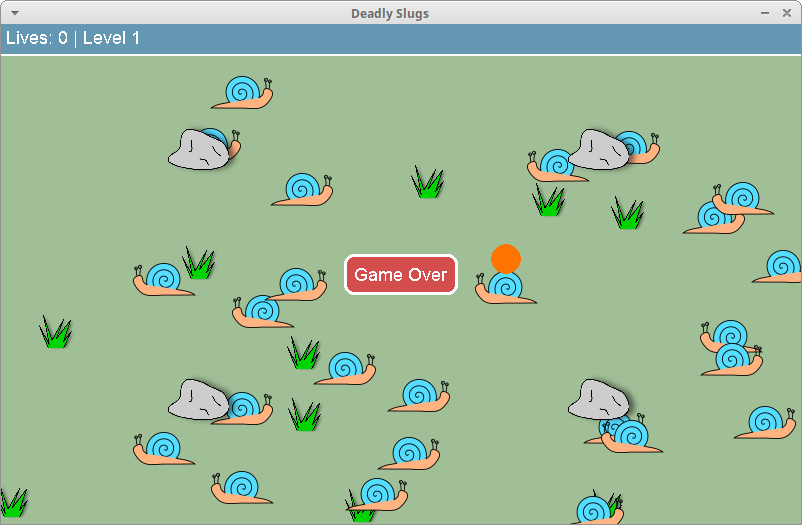
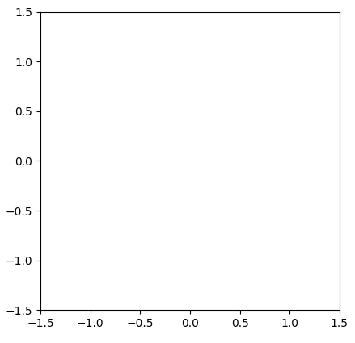

# misc-mini-project

A collection of small, miscellaneous code snippets and experiments.

## Installation

Each mini project has its own `requirements.txt` inside its folder.

To install dependencies for one project:

```bash
cd <project-folder>
python3 -m venv .venv
source .venv/bin/activate
python -m pip install --upgrade pip
python -m pip install -r requirements.txt
```

## Projects

### Barnsley Fern

* **Files:** [barnsely_fern](barnsley_fern).
* **References:** [Barnsly fern, Wikipedia](https://en.wikipedia.org/wiki/Barnsley_fern)



### Mandelbrot Set

* **Files:** [mandelbrot_set](mandelbrot_set).
* **References:** [Mandelbrot set, Wikipedia](https://en.wikipedia.org/wiki/Mandelbrot_set)

|  |  |
| --- | --- | 

### Perlin Noise

* **Files:** [perlin_noise](perlin_noise).
* **References:** [Perlin noise, Wikipedia](https://en.wikipedia.org/wiki/Perlin_noise)



### Ionizing Radiation Art

* **Files:** [ionizing_radiation_art](ionizing_radiation_art).


### Runge-Kutta 4 Solver

* **Files:** [runge_kutta_4](runge_kutta_4).
* **References:** [Runge-Kutta methods, Wikipedia](https://en.wikipedia.org/wiki/Runge%E2%80%93Kutta_methods)



### Deadly Slugs

* **Files:** [deadly_slugs](deadly_slugs).

|  |  |
| --- | --- | 

### Plane Rotation using Complex Numbers

* **Files:** [plane_rotation](plane_rotation).



## Copyright

Copyright Aaron Dettmann.
