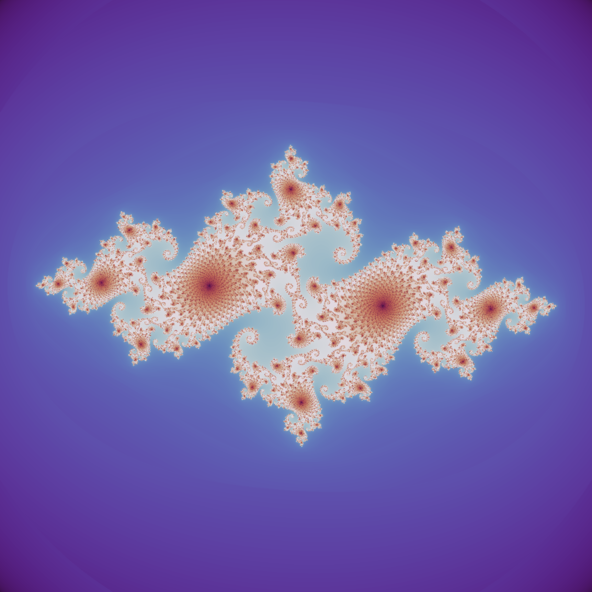
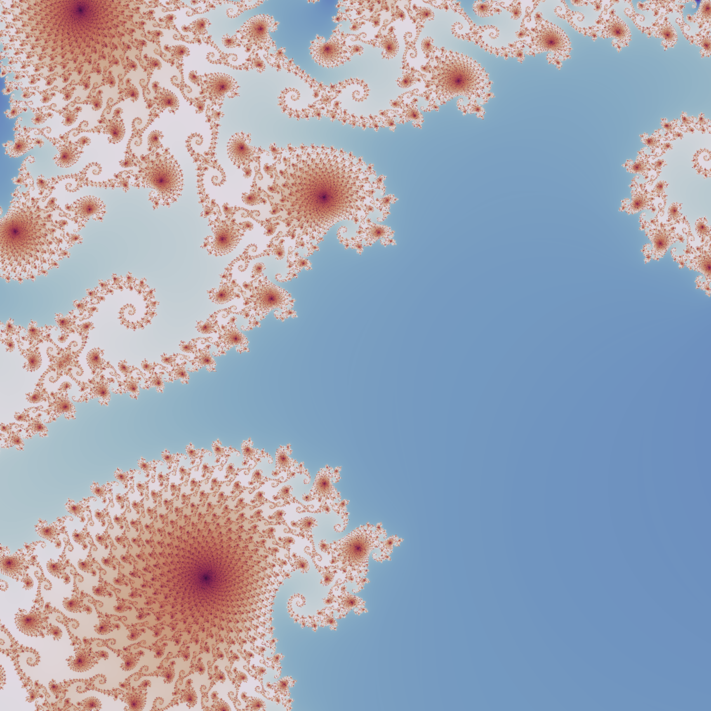

# Julia Set Zoomer

This mini-project renders a Julia set and exports a zoom animation into a detailed region.

## Install

```bash
python3 -m venv .venv
source .venv/bin/activate
python -m pip install --upgrade pip
python -m pip install -r requirements.txt
```

## Equation

The iteration is

$$
z_{n+1} = z_n^2 + c
$$

with fixed complex parameter \(c\), while each pixel provides a different initial value \(z_0\).
This script uses

$$
c = -0.74543 + 0.11301 i.
$$

## Run

```bash
python julia_set_zoomer.py
```

Outputs:

* `julia_overview.png`
* `julia_zoom.png`
* `julia_zoom.gif`

|  |  |
| --- | --- |


## References

* [Julia set, Wikipedia](https://en.wikipedia.org/wiki/Julia_set)
