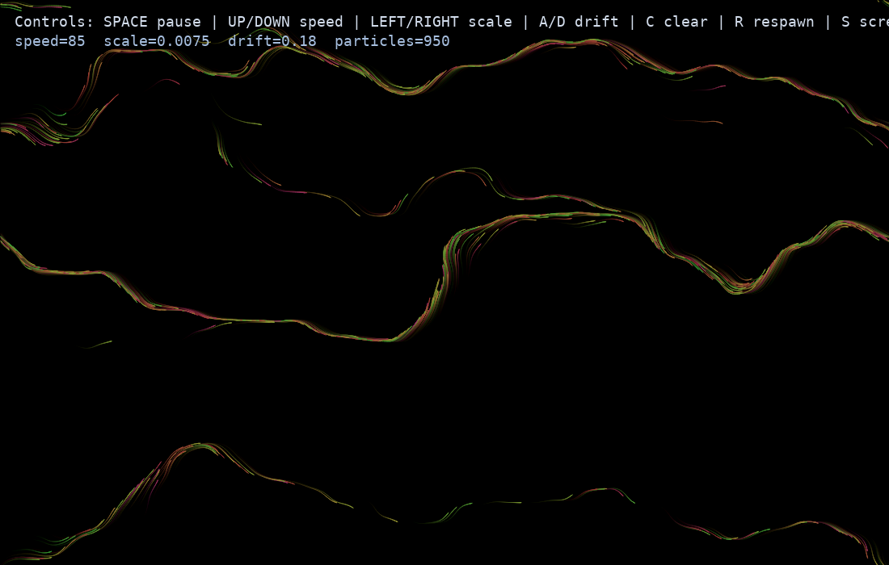

# Perlin Flow Playground

An interactive particle-flow sketch where trajectories are steered by a Perlin-noise vector field.

## Install

```bash
python3 -m venv .venv
source .venv/bin/activate
python -m pip install --upgrade pip
python -m pip install -r requirements.txt
```

## Run (interactive)

```bash
python perlin_flow_playground.py
```

Controls:

* `SPACE` pause/resume
* `UP` / `DOWN` increase/decrease particle speed
* `LEFT` / `RIGHT` decrease/increase flow scale
* `A` / `D` decrease/increase field drift
* `C` clear trails
* `R` respawn particles
* `S` save screenshot
* `ESC` quit

## Generate a sample image

```bash
python perlin_flow_playground.py --demo
```

This writes `perlin_flow_playground.png` in the project folder.



## Reference

* [Perlin noise, Wikipedia](https://en.wikipedia.org/wiki/Perlin_noise)
